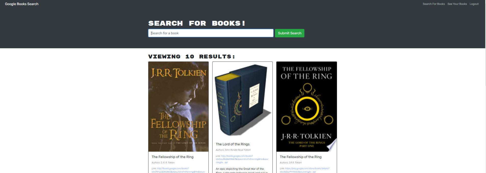

# Book Search Engine Starter Code
## Description
This a project with RESTful API , MERN stack and apollo server. Users can create account to save a reading list book 

# technogolies used
- React App
- React
- Node.js
- Express.js
- MongoDB and Mongoose
- JSON Web Tokenk
- JavaScript ES5 and ES6
- HTML and CSS
- Heroku

# Screenshot 
